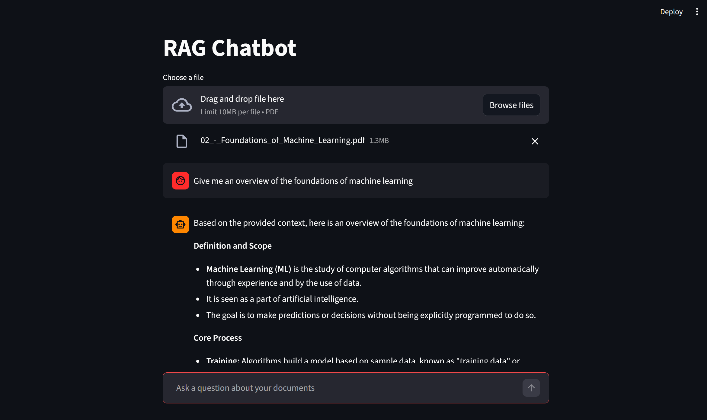

# RAG Chatbot

A conversational chatbot that lets you upload PDF documents and ask 
questions about their content. Built using Retrieval-Augmented 
Generation (RAG) to provide accurate, document-grounded answers 
without relying on the LLM's training data.

## Use Case

Large PDF documents like travel policies, manuals, or reports are 
time-consuming to read through manually. This chatbot lets you query 
them conversationally and get instant, accurate answers grounded in 
the document content.

## How It Works
```
PDF Upload → Chunking → Embeddings → Vector Store (ChromaDB)
                                            ↓
User Question → Embeddings → Similarity Search → Prompt + Context → LLM → Answer
```

1. Uploaded PDFs are split into overlapping chunks to preserve context 
   at boundaries
2. Each chunk is embedded using a local embedding model and stored in 
   ChromaDB
3. At query time the user's question is embedded and a similarity 
   search retrieves the most relevant chunks
4. Retrieved chunks are injected into a prompt template alongside the 
   question and sent to the LLM
5. The LLM generates an answer grounded strictly in the retrieved context

## Tech Stack

- **LLM & Embeddings** — Ollama (local and cloud models)
- **RAG Framework** — LangChain with LCEL
- **Vector Database** — ChromaDB
- **UI** — Streamlit
- **Language** — Python

## Key Technical Decisions

**Chunk size and overlap** — After considering the tradeoff between 
context preservation and retrieval precision, chunks are set to 500 
characters with a 50 character overlap. This preserves context at 
boundaries without introducing too much noise into similarity search 
results.

**Deduplication** — Before indexing, the app checks ChromaDB metadata 
for the filename to avoid re-indexing documents that are already in 
the vector store, preventing duplicate vectors from skewing retrieval.

**LCEL chain** — Used LangChain Expression Language to declaratively 
compose the retrieval and generation pipeline, keeping the querying 
logic concise and readable.

## Setup

1. Clone the repository
   git clone https://github.com/NafeelNuhuman/rag-chatbot.git
   cd rag-chatbot

2. Install Ollama from https://ollama.com and pull the required models
   ollama pull nomic-embed-text

3. Create a virtual environment and install dependencies
   python -m venv venv
   venv\Scripts\activate
   pip install -r requirements.txt

4. Run the app
   streamlit run app.py

5. Open your browser at http://localhost:8501

## Project Structure
```
rag-chatbot/
├── data/              # Uploaded PDF documents
├── vectorstore/       # ChromaDB persisted vectors
├── app.py             # Streamlit UI
├── rag.py             # Core RAG logic (indexing and querying)
├── config.py          # Configuration (chunk size, model names etc.)
└── requirements.txt   # Project dependencies
```

